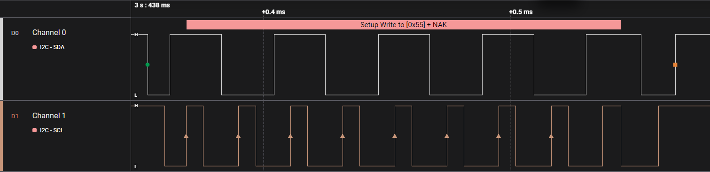

# ch32-soft-i2c

Легка програмна (Software) I2C бібліотека для мікроконтролерів CH32V00X.

### Сумісність
- Платформа: CH32V00X
- Залежності: [ch32-time](https://github.com/yevheniisukhominskiy/ch32-time) (для затримок)

### Зміст
- [Використання](#usage)
- [Функції](#functions)
- [Приклад](#example)
- [Встановлення](#install)
- [Ліцензія](#license)

## <a name="usage"></a>Використання
Бібліотека реалізує протокол I2C програмним методом (Bit-banging), що дозволяє використовувати будь-які GPIO піни для SDA та SCL.

## <a name="functions"></a>Основні функції
- `softi2c_init(SoftI2_t* i2c)` — ініціалізація GPIO для роботи I2C.
- `softi2c_start(SoftI2_t* i2c)` — формування умови START.
- `softi2c_stop(SoftI2_t* i2c)` — формування умови STOP.
- `softi2c_writebyte(SoftI2_t* i2c, uint8_t data)` — запис одного байта даних.

## <a name="example"></a>Приклад
Код із `main.c`:
```c
#include "debug.h"
#include "time.h"
#include "soft_i2c.h"

SoftI2_t i2c = {
    .sda_port = GPIOC,
    .sda_pin  = GPIO_Pin_7,
    .scl_port = GPIOC,
    .scl_pin  = GPIO_Pin_5
};

int main(void)
{
    SystemCoreClockUpdate();
    systick_init(); 
    
    RCC_PB2PeriphClockCmd(RCC_PB2Periph_GPIOC, ENABLE);
    softi2c_init(&i2c);
    
    while(1)
    {
        softi2c_start(&i2c);
        softi2c_writebyte(&i2c, 0xAA);
        softi2c_stop(&i2c);

        delay_ms(3000);
    }
}
```

### Результат роботи

*Код із main.c робочий, що підтверджується знімком з логічного аналізатора.*

## <a name="install"></a>Встановлення
1. Скопіюйте папку `lib` у ваш проект.
2. Додайте шлях до заголовочних файлів у налаштуваннях компілятора.
3. Додайте `#include "soft_i2c.h"` у ваш код.

## <a name="license"></a>Ліцензія
MIT
